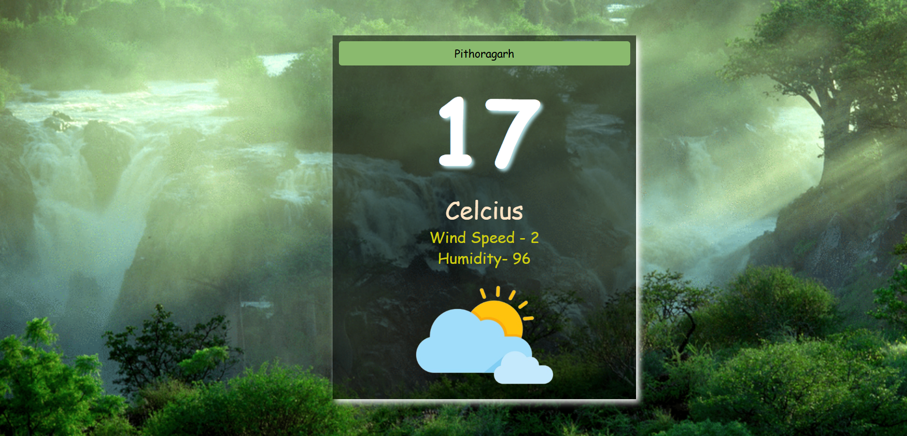

visit - https://weatherdash1.netlify.app/
# 🌤 Weather Forecasting System

A simple and elegant weather forecasting web app built with **HTML**, **CSS**, and **JavaScript** using the **OpenWeatherMap API**. This app fetches real-time weather data based on the user's input and displays weather information such as temperature, weather condition, humidity, and wind speed.

## 🚀 Features

- 🌍 Get current weather for any city in the world
- 📍 Search weather by city name
- 🌡 Displays:
  - Temperature
  - Weather condition (e.g., clear, rain, cloudy)
  - Humidity
  - Wind speed
- 🖼 Clean and responsive UI

## 🛠 Technologies Used

- HTML5
- CSS3
- JavaScript (Vanilla)
- OpenWeatherMap API

## 📷 Screenshots



## 🌐 Live Demo

🔗 [View Live](https://your-netlify-url.netlify.app)  
*(Replace with your deployed site link)*

## 🔑 Getting Started

### 1. Clone the repository

```bash
git clone https://github.com/yourusername/weather-forecast-app.git
cd weather-forecast-app
